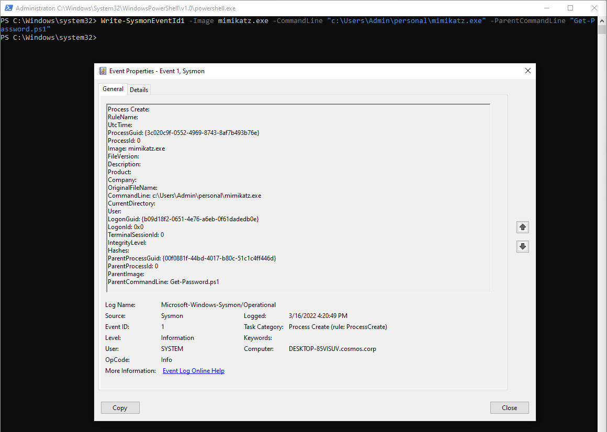
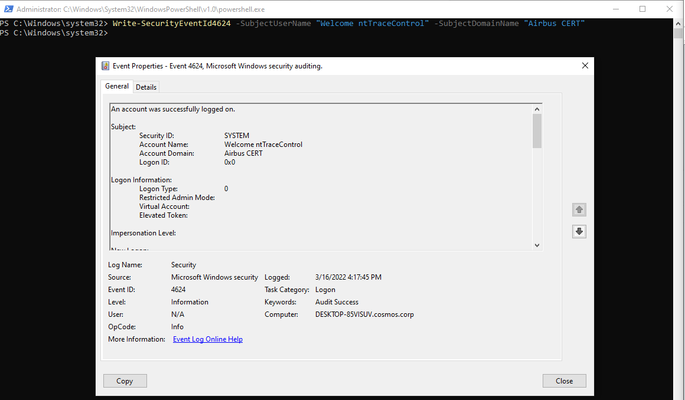
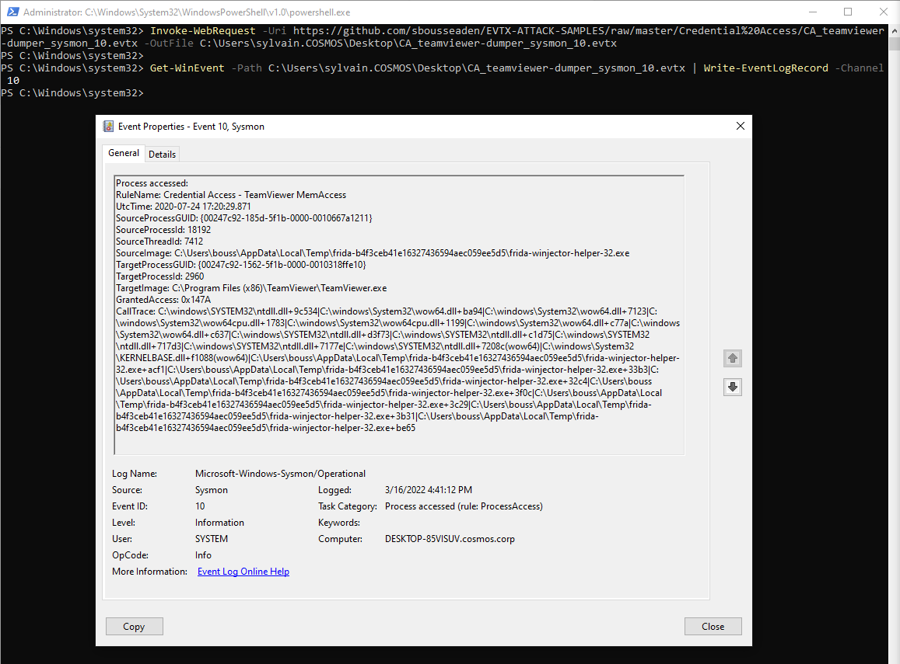
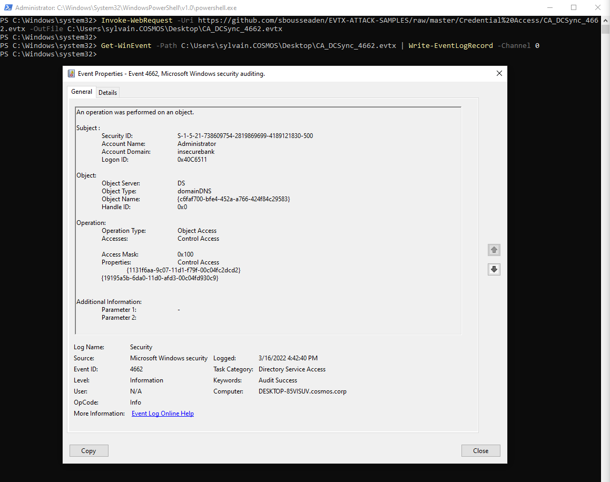
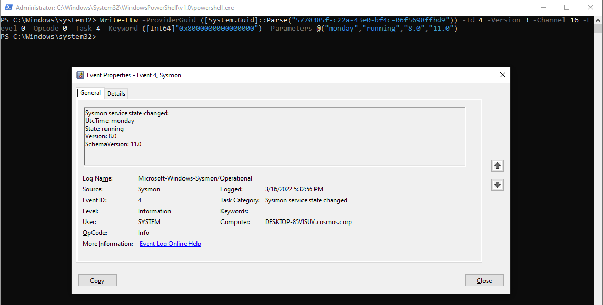

# ntTraceControl
PowerShell Event Tracing Toolbox


`ntTraceControl` is a set of PowerShell commands to emulate log generation. The main goal is helping Detection engineers testing detection use cases without needing to deal with complex infrastructure, tools, or vulnerability exploits, and focus on quality.

# Use Cases

## Write Sysmon Create Process Event

Detection teams may rely on Sysmon to create advanced detection rules. `ntTraceControl` includes dedicated cmdlets for Sysmon through `Write-SysmonEventId*`:

```
Write-SysmonEventId1 -Image mimikatz.exe -CommandLine "c:\Users\Admin\personal\mimikatz.exe" -ParentCommandLine "Get-Password.ps1"
```




## Write Security Logon

`Microsoft-Windows-Audit-Security` is the provider used to log messages like 4624 used to record a login session. All security logs are available through the `Write-SecurityEventId*` cmdlets:

```
Write-SecurityEventId4624 -SubjectUserName "Welcome ntTraceControl" -SubjectDomainName "Airbus CERT" 
```



## Write an EventLogRecord (EVTX file)

Modern PowerShell includes cmdlets to parse windows logs files (.evtx) and produce `EventLogRecord` objects. `ntTraceControl` includes a dedicated cmdlet to write `EventLogRecord` objects. As the .evtx file can include logs from different providers, we recommend using an system-privileged PowerShell instance.

To demonstrate, we used the wonderful [EVTX-ATTACK-SAMPLES](https://github.com/sbousseaden/EVTX-ATTACK-SAMPLES) repository from [@SBousseaden](https://twitter.com/SBousseaden)!

```
Invoke-WebRequest -Uri https://github.com/sbousseaden/EVTX-ATTACK-SAMPLES/raw/master/Credential%20Access/CA_teamviewer-dumper_sysmon_10.evtx -OutFile C:\Users\sylvain.COSMOS\Desktop\CA_teamviewer-dumper_sysmon_10.evtx

Get-WinEvent -Path C:\Users\sylvain.COSMOS\Desktop\CA_teamviewer-dumper_sysmon_10.evtx | ForEach-Object {$_ | Write-EventLogRecord -Channel 10}
```



```
Invoke-WebRequest -Uri https://github.com/sbousseaden/EVTX-ATTACK-SAMPLES/raw/master/Credential%20Access/CA_DCSync_4662.evtx -OutFile C:\Users\sylvain.COSMOS\Desktop\CA_DCSync_4662.evtx

Get-WinEvent -Path C:\Users\sylvain.COSMOS\Desktop\CA_DCSync_4662.evtx | ForEach-Object {$_ | Write-EventLogRecord -Channel 0}
```



# Write-Etw

All cmdlets are based on a more generic one named `Write-Etw`. This cmdlet has no context from the provider and can be used to produce logs that are not yet supported by a dedicated function.

Here is an example to produce an Sysmon Event ID 4 "service state changed", from the Sysmon provider:

```
Write-Etw -ProviderGuid ([System.Guid]::Parse("5770385f-c22a-43e0-bf4c-06f5698ffbd9")) -Id 4 -Version 3 -Channel 16 -Level 0 -Opcode 0 -Task 4 -Keyword ([Int64]"0x8000000000000000") -Parameters @(“monday”,”running”,”8.0”,”11.0”)
```



# How to install

An installer is provided under the [Releases](https://github.com/airbus-cert/ntTraceControl/releases/) page. It will install the PowerShell module for all users.

# How it works

We rely on `NtTraceControl` and `NtTraceEvent` syscalls to produce any kind of ETW.
To write an ETW, we need first register the associated provider GUID, with `Connect-Event` cmdlet, then write a message using `Write-Event` cmdlet, then disconnect the provider using `Disconnect-Event`.

In most cases, administrator rights are needed to produce a log.

For security reasons, the provider `Microsoft-Windows-Audit-Security` is not managed using the straight API. Only the lsass process can produce Security logs. To simulate security logs, `ntTraceControl` will inject a payload into the `lsass.exe` process to call the proper API. You therefore need system privileges to properly inject into lsass.

We use the Transluator project create PowerShell functions, with strong type enforcement deduced from the ETW provider manifest. Sometimes we have to customize a little bit what is automatically extracted from the manifest, this is why we versioned the output files.

For example the following command will Generate `WriteSysmon.ps1`:

```
Translator.exe -p Microsoft-Windows-Sysmon -c 17 -s Sysmon -o .\WriteSysmon.ps1 -k 0x8000000000000000
```

We generated functions for the following providers:

|Name|GUID|CmdLet Pattern|
|----|----|--------------|
|Microsoft-Windows-PowerShell|a0c1853b-5c40-4b15-8766-3cf1c58f985a|Write-PowerShellEventId*|
|Microsoft-Windows-RemoteDesktopServices-RdpCoreTS|1139c61b-b549-4251-8ed3-27250a1edec8|Write-RdpCoreTSEventId*|
|Microsoft-Windows-TerminalServices-RemoteConnectionManager|c76baa63-ae81-421c-b425-340b4b24157f|Write-RdpCoreTSEventId*|
|Microsoft-Windows-Security-Auditing|54849625-5478-4994-a5ba-3e3b0328c30d|Write-SecurityEventId*|
|Microsoft-Windows-Sysmon|5770385f-c22a-43e0-bf4c-06f5698ffbd9|Write-SysmonEventId*|
|Microsoft-Windows-WMI-Activity|1418ef04-b0b4-4623-bf7e-d74ab47bbdaa|Write-WMIActivityEventId*|

Since generating new functions only requires a call to the Transluator project, it will be easy to add more if needed.
